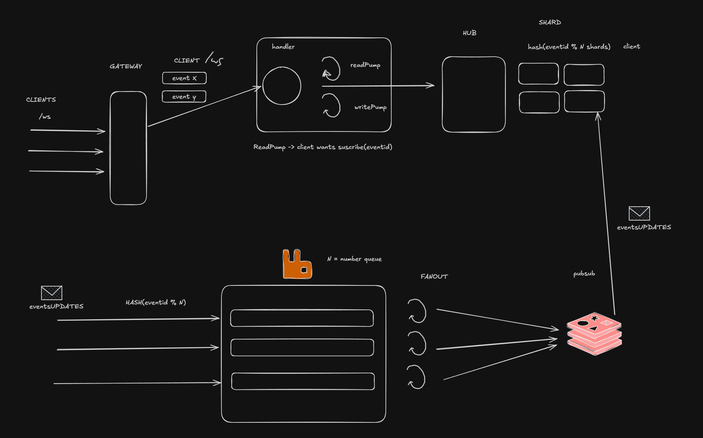

# go-sharded-ws-hub

Hub de WebSockets shardeado para difundir cambios de cuotas en tiempo real.

## Arquitectura



**Camino de entrada (arriba).** Los clientes abren `/ws` contra el gateway. El
handler hace el upgrade y crea un `Client` con dos goroutines: `readPump`, que
lee los comandos del navegador (`subscribe(eventId)`), y `writePump`, la única
que escribe en el socket. El `readPump` llama al hub, que elige shard con
`hash(eventId) % nShards` y guarda al cliente en el mapa de ese shard.

**Camino de actualizaciones (abajo).** Los `eventUPDATES` externos se reparten
por colas con el mismo criterio, `hash(eventId) % N`, para que los cambios de un
mismo evento se procesen en orden. Los workers de fan-out publican en pub/sub, y
cada instancia del hub recibe lo que corresponde a los eventos que tiene
suscritos y se lo empuja a los clientes de ese shard.

## Estructura

Monorepo con **dos servicios independientes**, cada uno su propio módulo Go y su
propio hexágono (ports + adapters). No comparten código: se despliegan, versionan
y escalan por separado, y se comunicarán por la red (gRPC / pub-sub).

```
go.work               solo para desarrollo local en el monorepo

gateway/              SERVICIO 1 — módulo .../go-sharded-ws-hub/gateway
  go.mod              deps propias: gorilla/websocket, google/uuid
  cmd/gateway/        binario que sirve /ws
  internal/
    domain/           su modelo: Event, Market, Odd, OddUpdate
    ports/
      inbound/        Hub — lo que los adapters de entrada invocan
      outbound/       Client — lo que el hub invoca
    hub/              Hub + Shards: registro de suscripciones y fan-out
    adapters/
      inbound/ws/     handler + client (gorilla/websocket)
      inbound/grpc/   (pendiente) recibe los updates de ingestion

ingestion/            SERVICIO 2 — módulo .../go-sharded-ws-hub/ingestion
  go.mod              sin deps todavía
  cmd/ingestion/      binario del pipeline (pendiente)
  internal/
    domain/           su propio modelo, independiente del de gateway
    ports/
      inbound/        casos de uso que disparan los adapters de entrada
      outbound/       lo que el pipeline necesita del exterior (publisher…)
    pipeline/         colas por hash(eventId) % N + workers de fan-out
    adapters/
      inbound/http/   entrada de updates externos
      outbound/grpc/  (pendiente) cliente hacia gateway
      outbound/redis/ (pendiente) publicación en pub/sub
```

Reglas:

- La dependencia va siempre hacia dentro: `hub` y `pipeline` no importan nunca
  `adapters`.
- **Ningún servicio importa al otro.** Cada uno tiene su copia del dominio; el
  contrato entre ambos vive en el `.proto` / el payload, no en un paquete Go
  compartido. Si un día cambia, se versiona el contrato, no se recompilan los dos
  a la vez.
- `go.work` es una comodidad local. Cada carpeta compila sola:
  `cd gateway && go build ./...` funciona sin la otra, y podrías moverla a su
  propio repo tal cual.

## Ejecutar

```bash
go run ./gateway/cmd/gateway     # levanta el ws en :8080
```
